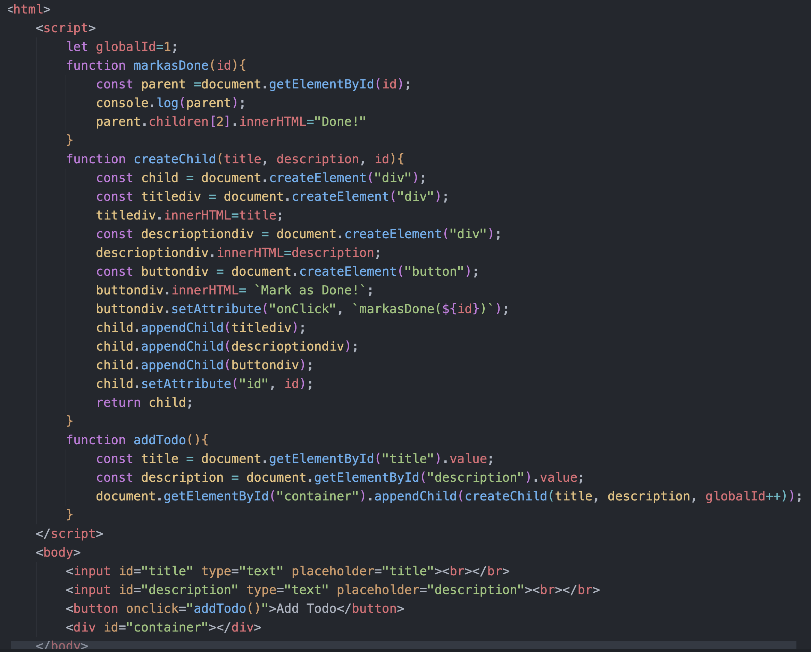

## Frontend Frameworks ?

    Why these frameworks exist.
    what problems do they solve. 
    why we use React/Vue/etc.

DOM Manipulation

    DOM manipulation is very hard to write as a developer.
    Which means making dynamic websites, with the premitives that DOM provides
    you is very hard.
    So that is the reason React is introduced.

    - Primitives provided by DOM :
        document.createElement
        document.appendChild
        element.setAttribute
        element.children
        
    

We tried to create a Todo app using DOM manipulation

    Problem with this approach is that, it is hard ti add and remove elements.
    also, no central state.

    